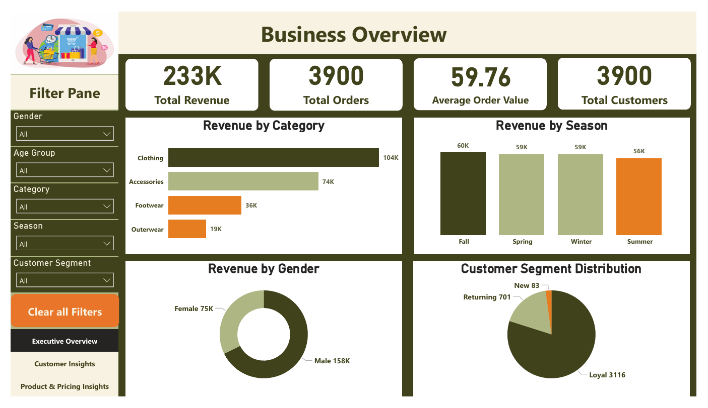
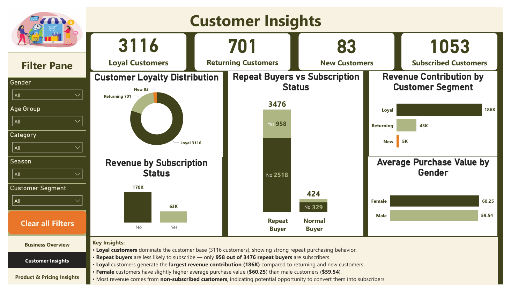
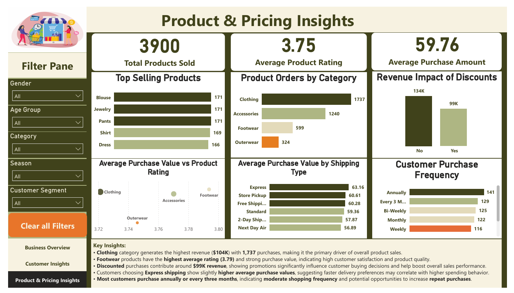

# 🛍️ Customer Shopping Behavior Analysis


## 📌 Executive Summary

This project analyzes customer shopping behavior to uncover insights related to customer loyalty, purchasing patterns, and product performance.

Using **Python, SQL, and Power BI**, the project transforms raw transactional data into business insights that help answer critical questions about customer segments, discount effectiveness, and revenue drivers.

The final output is an **interactive Power BI dashboard** that enables stakeholders to quickly understand customer trends and make data-driven business decisions.

---

# 📊 Project Overview

Retail companies generate massive amounts of transaction data, but extracting meaningful insights from it can be challenging.

This project analyzes **customer shopping behavior** to answer key business questions related to:

- 🛍 Customer spending patterns
- 🔁 Loyalty and repeat purchases
- 💰 Discount impact on revenue
- 📦 Product performance
- ⭐ Subscription behavior

The analysis combines **Python for exploration**, **SQL for business queries**, and **Power BI for interactive dashboards**.

---

# 🎯 Business Problem

This project aims to answer the following questions:

* 🧑‍🤝‍🧑 Which customer segments generate the most revenue?
* 💰 Do discounts increase purchase value?
* 🔁 Are repeat customers more likely to subscribe?
* 📦 Which products and categories perform the best?
* 🚚 Does shipping type affect purchase behavior?

---

# 🗂 Dataset Description

The dataset contains **customer shopping transaction records** including demographics, purchase behavior, and product information.

### Key Features

* Customer demographics (Age, Gender, Location)
* Product information (Item Purchased, Category, Size, Color)
* Purchase behavior (Purchase Amount, Discount Applied, Promo Code Used)
* Customer engagement (Subscription Status, Previous Purchases)
* Product feedback (Review Rating)
* Logistics (Shipping Type)

### Dataset Size

📄 **Total Records:** 3,900
📊 **Total Columns:** 18

---

# 🛠 Tools & Technologies

### 🐍 Python (Data Analysis)

* Pandas
* NumPy
* Matplotlib
* Seaborn

Used for:

* Data cleaning
* Exploratory Data Analysis (EDA)
* Feature engineering
* Data preparation

---

### 🗄 SQL (Business Analysis)

Used to answer key business questions through:

* Customer segmentation
* Revenue analysis
* Product performance queries
* Behavioral analysis

---

### 📊 Power BI (Data Visualization)

Used to build an **interactive business dashboard** including:

* KPI tracking
* Customer insights
* Product performance analysis

---

# 🧹 Data Cleaning & Preparation

Before analysis, several preprocessing steps were performed:

- ✔ Checked for missing values 
- ✔ Removed duplicate records 
- ✔ Standardized column naming 
- ✔ Converted data types 
- ✔ Created new analytical features 

### Feature Engineering

Two important features were created:

**Customer Segment**

* 🆕 New Customers
* 🔁 Returning Customers
* ⭐ Loyal Customers

**Age Group**

Customers were grouped into age categories to improve demographic analysis.

---

# 📈 Exploratory Data Analysis (Python)

EDA was conducted to understand purchasing behavior and demographic patterns.

### Key Observations

* 👩 Female customers show slightly higher average purchase value.
* ⭐ Loyal customers represent the largest portion of the customer base.
* 👨‍👩‍👧 Adult and middle-aged customers contribute the highest share of revenue.

---

# 🧠 SQL Business Analysis

SQL queries were used to answer important business questions.

Key analyses include:

* 💰 Revenue by gender
* 🏷 High-spending discount users
* ⭐ Top 5 products by rating
* 🚚 Shipping type comparison
* 📊 Subscribers vs non-subscribers spending
* 🔁 Customer segmentation analysis
* 🛍 Top 3 products per category
* 📈 Revenue by age group
* 📦 Revenue by product category

---

# 📊 Power BI Dashboard

An **interactive dashboard** was developed with three analytical pages.

### 📌 Business Overview

Displays high-level KPIs:

* Total Revenue
* Total Orders
* Average Order Value
* Total Customers



---

### 👥 Customer Insights

Focuses on understanding customer behavior:

* Gender spending comparison
* Loyalty distribution
* Customer segmentation
* Subscription behavior



---

### 🛍 Product & Pricing Insights

Analyzes product and pricing performance:

* Top performing products
* Discount impact
* Rating influence
* Shipping analysis
* Purchase frequency trends



---

# 🔍 Key Insights

* ⭐ Loyal customers represent the largest segment.
* 👩 Female customers have slightly higher purchase value.
* 🏷 Discounts do **not significantly increase purchase value**.
* 🔁 Repeat buyers are **more likely to subscribe**.
* ⭐ Highly rated products tend to generate **higher revenue**.

---

# 💡 Business Recommendations

### 1️⃣ Focus on Customer Retention

Implement **loyalty programs and personalized marketing campaigns**.

### 2️⃣ Target Repeat Buyers for Subscriptions

Repeat customers show **higher subscription potential**.

### 3️⃣ Optimize Discount Strategy

Instead of heavy discounting, use **targeted promotions**.

### 4️⃣ Promote Highly Rated Products

Highlight **top-rated products in marketing campaigns**.

---

# 📁 Project Structure

```
Customer_Shopping_Behavior_Analysis

│
├── data/
│    └── customer_shopping_behavior.csv
│
├── images/
│    └── dashboard_page1.png
│    └── dashboard_page2.png
│    └── dashboard_page3.png
│
├── notebooks/
│   ├── Customer Shopping Behavior Analysis.ipynb
│   └── SQL Analysis.ipynb
│
├── scripts/
│   └── data_preparation.py
│
├── powerbi/
│   └── customer_shopping_behavior_dashboard.pbix
│
├── report/
│   └── Customer_Shopping_Behavior_Project_Report.pdf
│
└── README.md
```

---

# 🚀 Skills Demonstrated

### Data Analysis
- Data cleaning and preprocessing
- Exploratory Data Analysis (EDA)
- Feature engineering
- Statistical analysis

### SQL Analytics
- Business query analysis
- Customer segmentation
- Revenue analysis
- Aggregation and window functions

### Data Visualization
- Dashboard design
- KPI development
- Business storytelling

### Tools & Technologies
- Python (Pandas, NumPy, Matplotlib, Seaborn)
- SQL
- Power BI
- Jupyter Notebook

---

# 👨‍💻 Author

**Mohd Atir**

Aspiring Data Analyst

💡 Skills: Python | SQL | Excel | Power BI | Data Visualization | Business Analytics

## 🤝 Connect With Me

If you found this project interesting or would like to discuss data analytics opportunities, feel free to connect.

🔗 **LinkedIn**  
[Connect With Me](https://www.linkedin.com/in/mohd-atir/)

📧 **Email**  
[Contact Us](mohdatir788@gmail.com)

---

⭐ If you found this project helpful, feel free to **star the repository**.
